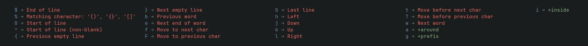

# NeoVim with nvchad cheet cheat

check this 

C = Ctr
A = Alt
S = Shift
<leader> = space

`C n` -> open explorer

## Copy (yank) Paste

`yy`->  copy current line
`:m,n yank` -> where m and n are the line numbers you want to copy.

`p` -> paste after the cursor
`P` -> paste before the cursor

## File navigation

`G` -> move the end of the file.
`$`-> move to the end of the line.
`g_`-> move to the last non-whitespace character

## Visual mode

Check this 

## Undo Redo

`u` -> undo or `:u` or `:undo`

`C R` -> redo or `4C R` will undo last 4 steps.
